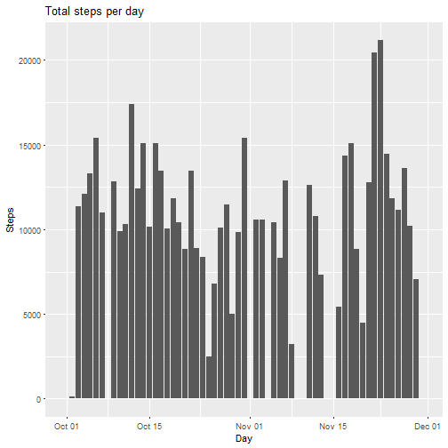
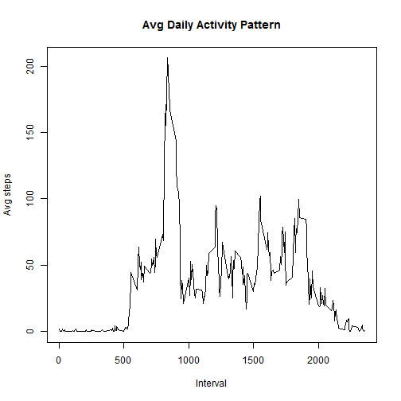
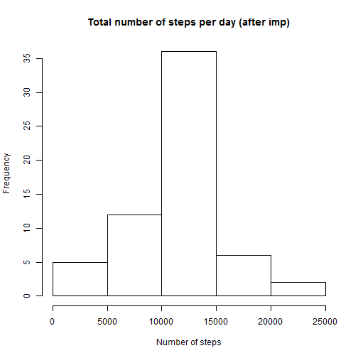
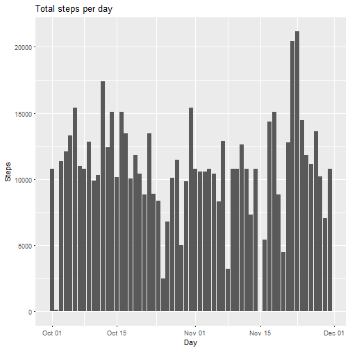
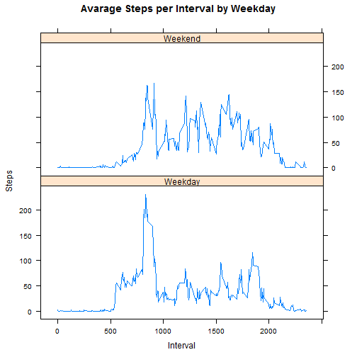

Reproducible Research Course Project 1
========================================

This assignment analyzes data from a personal activity monitoring device. This device collects data at 5 minute intervals through out the day. The data consists of two months of data from an anonymous individual collected during the months of October and November, 2012 and include the number of steps taken in 5 minute intervals each day.


## Loading and preprocessing the data


```r
setwd("C:/Projects/Training/R/Reproducible Research/Data")
library(dplyr)
library(ggplot2)
library(lattice)
library(knitr)
```


```r
activity <- read.csv("activity.csv")
activity$date <- as.Date(activity$date, "%Y-%m-%d")
```

The variables included in this dataset are:

- steps: Number of steps taking in a 5-minute interval (missing values are coded as NA)
- date: The date on which the measurement was taken in YYYY-MM-DD format
- interval: Identifier for the 5-minute interval in which measurement was taken
The dataset is stored in a comma-separated-value (CSV) file and there are a total of 17,568 observations in this dataset.


## What is mean total number of steps taken per day?


```r
table_1 <- group_by(activity, date)
table_2 <- summarise(table_1, Total_steps=sum(steps))

hist(table_2$Total_steps, main="Total number of steps per day", xlab="Number of steps")
```



```r
mean(table_2$Total_steps, na.rm=T)
```

```
## [1] 10766.19
```

```r
median(table_2$Total_steps, na.rm = T)
```

```
## [1] 10765
```

The mean Total number of steps per day is 10766.19 and the median is 10765.

## What is the average daily activity pattern?


```r
means <- tapply(activity$steps, as.factor(activity$interval), mean, na.rm = T)
int_f <- as.factor(activity$interval)
plot(levels(int_f), means, type="l", xlab = "Interval", ylab = "Avg steps", main = "Avg Daily Activity Pattern")
```



```r
which.max(means)
```

```
## 835 
## 104
```

The daily activities begin after the 500th interval with a peak in the 835th interval.

## Imputing missing values

When there are missing values for the intervals they were imputed with the average value for that interval for all observations.


```r
sum(is.na(activity$steps))
```

```
## [1] 2304
```

The total number of missing values is 2304.


```r
means_all <- rep(means, 61)
activity$Mean_by_int <- means_all
activity$steps_imp <- ifelse(is.na(activity$steps), activity$Mean_by_int, activity$steps)
activity_2 <- activity[,-1]

table_4 <- group_by(activity_2, date)
table_5 <- summarise(table_4, Total_steps=sum(steps_imp))

hist(table_5$Total_steps, main="Total number of steps per day (after imp)", xlab="Number of steps")
```



```r
mean(table_5$Total_steps)
```

```
## [1] 10766.19
```

```r
median(table_5$Total_steps)
```

```
## [1] 10766.19
```

After the imputation, the mean doesn't change but the median increases by 1.19.


```r
table_5 <- rename(table_5, Total_steps_imp=Total_steps)
table_7 <- cbind(table_2, table_5)

m <-  ggplot(table_7, aes(date)) + 
  geom_bar(aes(y = Total_steps_imp, fill = "Total_steps_imp"), stat = "identity") +
  geom_bar(aes(y = Total_steps, fill = "Total_steps"), stat = "identity") + 
  xlab("Day")+ylab("Steps")+ggtitle("Total steps per day")
m
```

```
## Warning: Removed 8 rows containing missing values (position_stack).
```



On the graph we can see the total number of steps before and after the imputation. When the steps were missing before the imputation, now we see a value.

## Are there differences in activity patterns between weekdays and weekends?


```r
activity_2$Weekday <- weekdays(activity_2$date)
activity_2$day_flag <- ifelse(activity_2$Weekday %in% c("Saturday", "Sunday"), "Weekend", "Weekday")
activity_2$day_flag <- as.factor(activity_2$day_flag)

grouped_data <- aggregate(steps_imp ~ interval + day_flag, activity_2, mean)
xyplot(steps_imp ~ interval | day_flag, data = grouped_data, xlab="Interval", ylab="Steps", main = "Avarage Steps per Interval by Weekday", layout=c(1,2), type="l")
```



During the weekend, there is higher activity in general, although in the weekdays, the maximum number of steps is higher than in the weekend.


